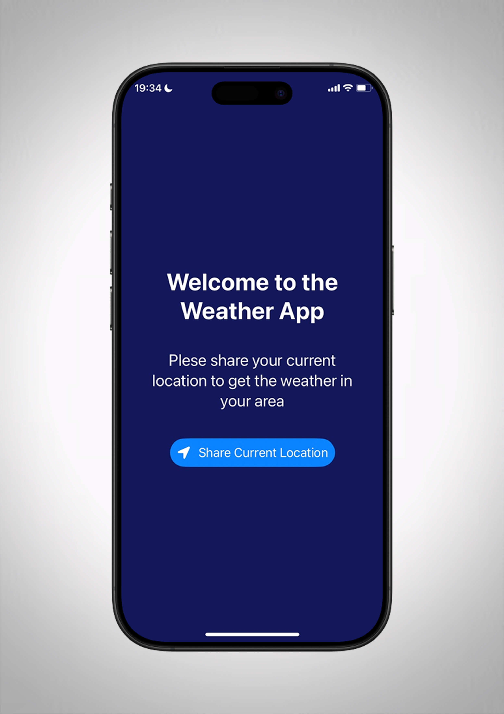

#🌤️ **Weather App**
Ce projet est une application météo qui utilise l'API OpenWeather pour afficher les conditions météorologiques en temps réel. Ce projet m'a permis de me familiariser avec SwiftUI et les appels réseau.

 

    
    

 

**Technologies utilisées :**
- ⚙️ SwiftUI
- 🌐 OpenWeather API
- 🗃️ JSON Parsing

**Fonctionnalités :**
- 🌡️ Affichage de la météo actuelle
- 🌬️ Détails sur la température, la vitesse du vent et l'humidité
- 📍 Localisation automatique
